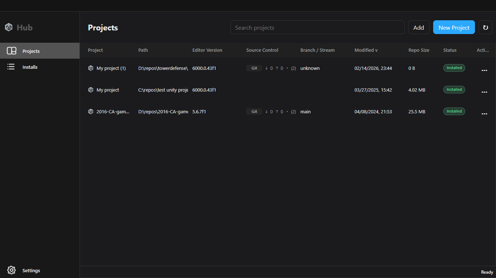

# Unity Launcher (MVP)

A lightweight Unity project launcher focused on projects, not cloud/learning tabs.

Live demo (mock data): https://hannesdelbeke.github.io/electron-unity-hub/

Project development instructions and architecture: [DEV.md](./DEV.md)

Project TODOs are intentionally kept out of `DEV.md`. Use [TODO.md](./TODO.md) for task tracking.

## Preview



## Implemented features

- Left sidebar tabs: Projects, Unity Installs, Settings
- Project nickname support (including multiple entries for the same project path)
- Project name, path
- Unity editor version detection (`ProjectSettings/ProjectVersion.txt`) with override field
- Last opened timestamp
- Source control status (Git + Perforce detection)
- Optional first-run import from Unity Hub cache (if Hub is installed)
- Unity installs list with click-to-launch editor
- Theme setting: Match System, Dark, Light
- Open behavior for already-open projects:
  - If project appears open (`Temp/UnityLockfile`), the app attempts to focus that Unity window instead of launching a duplicate
- Launch with a configured Unity executable path

## Requirements

- Node.js 20+
- npm 10+
- Windows/macOS/Linux (window focusing is currently implemented for Windows only)

## Run

```bash
npm install
npm start
```

## Browser Demo

The browser demo is generated from the desktop renderer with a mock browser API. It does not launch Unity, access local disk, or run real source-control commands.

To run locally:

```bash
npm run build:pages
cd pages-dist
python -m http.server 8080
```

Then open `http://localhost:8080`.

## Notes

- Desktop app data is stored in the OS user data folder (`app.getPath("userData")`) as `projects.json`.
- Git information is read using `git` CLI if available.
- Perforce information is read using `p4` CLI if available.
- The desktop app is intentionally read-only for source control status (no submit/sync actions).
